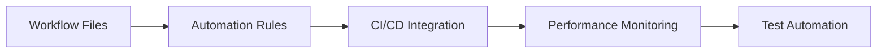
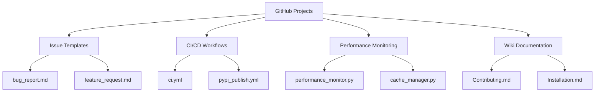

# GitHub Projects Setup - Complete Documentation Index

## 🎯 Project Overview

This comprehensive guide provides everything needed to implement GitHub Projects for the **polyID** polymer property prediction microservice. The setup balances **research workflows** and **software development**, specifically designed for ML research projects serving as microservices.

### 🏗️ Architecture Summary

**Three-Board System:**
- 🔬 **Research Board** - Scientific research, model development, validation
- 💻 **Development Board** - Features, bugs, infrastructure, performance
- 🚀 **Release Management** - Version planning, coordination, post-release

**Key Features:**
- ✅ Integration with existing CI/CD ([`ci.yml`](.github/workflows/ci.yml), [`pypi_publish.yml`](.github/workflows/pypi_publish.yml))
- ✅ Seamless connection to issue templates ([`bug_report.md`](.github/ISSUE_TEMPLATE/bug_report.md), [`feature_request.md`](.github/ISSUE_TEMPLATE/feature_request.md))
- ✅ Performance monitoring integration ([`performance_monitor.py`](polyid/performance_monitor.py), [`cache_manager.py`](polyid/cache_manager.py))
- ✅ PaleoBond-PCP microservice coordination
- ✅ Open source community management

## 📚 Documentation Structure

### 🚀 Primary Implementation Guide
| Document | Purpose | When to Use |
|----------|---------|-------------|
| **[GITHUB_PROJECTS_SETUP_GUIDE.md](GITHUB_PROJECTS_SETUP_GUIDE.md)** | **Master setup guide** | **Start here** - Complete implementation instructions |

### 🔧 Implementation Resources
| Document | Purpose | Implementation Phase |
|----------|---------|---------------------|
| **[PROJECT_TEMPLATES_AND_AUTOMATION.md](PROJECT_TEMPLATES_AND_AUTOMATION.md)** | Workflow files, scripts, templates | Setup & Configuration |
| **[PROJECT_DASHBOARD.md](PROJECT_DASHBOARD.md)** | Project health monitoring | Daily Operations |
| **[PROJECTS_BEST_PRACTICES.md](PROJECTS_BEST_PRACTICES.md)** | Practical examples & workflows | Daily Usage |
| **[PROJECTS_QUICK_REFERENCE.md](PROJECTS_QUICK_REFERENCE.md)** | Daily cheat sheet | **Keep handy** |

### 📋 Content Matrix

| Need | Setup Guide | Templates | Dashboard | Best Practices | Quick Reference |
|------|-------------|-----------|-----------|----------------|----------------|
| **Getting Started** | ✅ Primary | ✅ Files | ✅ Health | ✅ Examples | ✅ Commands |
| **Board Design** | ✅ Architecture | ✅ Fields | ✅ Metrics | ✅ Workflows | ✅ Status |
| **Automation** | ✅ Rules | ✅ Code | ✅ Monitor | ✅ Integration | ✅ Testing |
| **Daily Usage** | ✅ Process | ✅ Templates | ✅ Review | ✅ Examples | ✅ **Primary** |
| **Maintenance** | ✅ Guidelines | ✅ Scripts | ✅ KPIs | ✅ Optimization | ✅ Troubleshooting |

## 🛠️ Implementation Roadmap

### Phase 1: Initial Setup (Day 1)

**Tasks:**
1. **Read**: [GITHUB_PROJECTS_SETUP_GUIDE.md](GITHUB_PROJECTS_SETUP_GUIDE.md) - Quick Setup Guide section
2. **Execute**: Create three project boards using templates
3. **Configure**: Custom fields from template configurations
4. **Test**: Create test issues and verify routing

**Time Estimate:** 2-3 hours

### Phase 2: Automation Setup (Day 2)

**Tasks:**
1. **Implement**: Workflow files from [PROJECT_TEMPLATES_AND_AUTOMATION.md](PROJECT_TEMPLATES_AND_AUTOMATION.md)
2. **Configure**: Automation rules for issue routing and PR integration
3. **Integrate**: Performance monitoring alerts with project creation
4. **Test**: Automation with real issues and PRs

**Time Estimate:** 3-4 hours

### Phase 3: Team Onboarding (Week 1)

**Tasks:**
1. **Train**: Team on workflows using [PROJECTS_BEST_PRACTICES.md](PROJECTS_BEST_PRACTICES.md)
2. **Deploy**: [PROJECT_DASHBOARD.md](PROJECT_DASHBOARD.md) for health monitoring
3. **Establish**: Daily routines with [PROJECTS_QUICK_REFERENCE.md](PROJECTS_QUICK_REFERENCE.md)
4. **Collect**: Feedback and iterate on setup

**Time Estimate:** 1 week with gradual rollout

### Phase 4: Optimization (Month 1)

**Tasks:**
1. **Analyze**: Usage patterns and bottlenecks
2. **Optimize**: Automation rules and field configurations
3. **Scale**: Community contribution workflows
4. **Plan**: Long-term evolution and improvements

**Time Estimate:** Ongoing optimization

## 🔄 Integration Overview

### Existing Infrastructure Integration

### PaleoBond-PCP Coordination

Since polyID is a microservice supporting [PaleoBond-PCP](https://github.com/jkbennitt/PaleoBond-PCP):

**Integration Points:**
- API compatibility tracking
- Release coordination
- Performance synchronization
- Cross-project issue linking

**Implementation:**
- Dedicated Release Management board items
- Automated coordination issue creation
- Integration testing workflows
- Communication templates

## 📊 Success Metrics & KPIs

### Research Productivity
- **Literature Reviews**: 5 per week target
- **Model Development**: 2 models per week
- **Validation Studies**: 3 per week
- **Research → Publication**: 90 days average

### Development Velocity
- **Issue Resolution**: <48h average for bugs
- **Feature Delivery**: 3 features per sprint
- **Code Review**: <24h turnaround
- **Release Frequency**: Bi-weekly minor releases

### System Health
- **Performance Alerts**: <4h resolution time
- **CI/CD Success**: >95% success rate
- **Automation Health**: >98% success rate
- **Community Engagement**: 5+ new contributors/month

## 🎯 Usage Scenarios

### 1. Research Team Member
**Daily Routine:**
1. Check [PROJECTS_QUICK_REFERENCE.md](PROJECTS_QUICK_REFERENCE.md) for status updates
2. Use Research Board for literature reviews and model development
3. Link research items to development implementation
4. Track validation progress and scientific impact

**Tools:** Research Board, performance integration, validation templates

### 2. Software Developer
**Daily Routine:**
1. Review Development Board for assigned tasks
2. Use [PROJECTS_BEST_PRACTICES.md](PROJECTS_BEST_PRACTICES.md) for workflow examples
3. Integrate with CI/CD for automated project updates
4. Monitor performance alerts and optimization tasks

**Tools:** Development Board, CI/CD integration, performance monitoring

### 3. Project Maintainer
**Daily Routine:**
1. Check [PROJECT_DASHBOARD.md](PROJECT_DASHBOARD.md) for health metrics
2. Review automation status and performance
3. Coordinate with PaleoBond-PCP team
4. Manage community contributions and releases

**Tools:** All boards, dashboard, automation monitoring

### 4. Community Contributor
**Getting Started:**
1. Read [Contributing.md](.github/wiki/Contributing.md) and project setup guides
2. Use "good first issue" labels on Development Board
3. Follow contribution workflow in best practices guide
4. Get mentorship through project board assignments

**Tools:** Development Board, community labels, mentorship workflow

## 📋 Quick Start Checklist

### For Project Setup
- [ ] Read [GITHUB_PROJECTS_SETUP_GUIDE.md](GITHUB_PROJECTS_SETUP_GUIDE.md) completely
- [ ] Execute setup scripts from [PROJECT_TEMPLATES_AND_AUTOMATION.md](PROJECT_TEMPLATES_AND_AUTOMATION.md)
- [ ] Configure custom fields and automation rules
- [ ] Test with sample issues and PRs
- [ ] Set up performance monitoring integration
- [ ] Train team on workflows and best practices

### For Daily Usage
- [ ] Bookmark [PROJECTS_QUICK_REFERENCE.md](PROJECTS_QUICK_REFERENCE.md)
- [ ] Set up dashboard monitoring
- [ ] Establish morning routine (5-minute project review)
- [ ] Use appropriate board for different work types
- [ ] Update item status regularly throughout the day
- [ ] Weekly review using dashboard and best practices

### For Maintenance
- [ ] Weekly automation health checks
- [ ] Monthly dashboard metrics review
- [ ] Quarterly workflow optimization
- [ ] Regular community engagement and contributor onboarding
- [ ] Continuous integration with PaleoBond-PCP coordination

## 🔍 Troubleshooting Quick Links

### Common Issues
| Problem | Solution | Reference |
|---------|----------|-----------|
| Items not moving automatically | Check automation rules | [Setup Guide](GITHUB_PROJECTS_SETUP_GUIDE.md#workflow-automation) |
| Performance alerts not working | Verify monitoring integration | [Templates](PROJECT_TEMPLATES_AND_AUTOMATION.md#performance-monitoring-integration) |
| Research workflow bottlenecks | Review phase definitions | [Best Practices](PROJECTS_BEST_PRACTICES.md#research-project-management) |
| CI/CD integration problems | Check workflow permissions | [Templates](PROJECT_TEMPLATES_AND_AUTOMATION.md#workflow-automation-files) |
| Dashboard metrics stale | Update automation status | [Dashboard](PROJECT_DASHBOARD.md#automation-health) |

### Emergency Contacts
- **Setup Issues**: Reference main [Setup Guide](GITHUB_PROJECTS_SETUP_GUIDE.md)
- **Daily Problems**: Use [Quick Reference](PROJECTS_QUICK_REFERENCE.md#troubleshooting-quick-fixes)
- **Best Practices**: Check [Best Practices Guide](PROJECTS_BEST_PRACTICES.md#troubleshooting-common-issues)

## 📈 Evolution & Future Enhancements

### Planned Improvements
1. **Machine Learning Integration**: Automated priority scoring based on historical data
2. **Advanced Analytics**: Research productivity insights and prediction
3. **Cross-Repository**: Enhanced PaleoBond-PCP integration workflows
4. **Community Tools**: Advanced contributor onboarding and mentorship
5. **Performance Optimization**: Predictive performance issue detection

### Feedback & Iteration
- **Monthly Reviews**: Team feedback on workflow effectiveness
- **Quarterly Optimization**: Automation rules and field adjustments
- **Annual Overhaul**: Major architecture and tooling updates
- **Community Input**: Regular surveys and contribution analysis

## 🎉 Success Indicators

### Implementation Success
✅ **Complete Setup** - All three boards configured and operational  
✅ **Team Adoption** - 90%+ team members using daily workflows  
✅ **Automation Working** - Issues routing correctly, PRs integrating  
✅ **Performance Integration** - Monitoring alerts creating project items  
✅ **Community Engagement** - New contributors using project boards  

### Operational Success
✅ **Research Velocity** - Consistent progress through research phases  
✅ **Development Flow** - Healthy backlog management and delivery  
✅ **Release Coordination** - Smooth releases with PaleoBond-PCP sync  
✅ **System Health** - Proactive issue identification and resolution  
✅ **Documentation Current** - Guides updated and accurate  

### Long-term Success
✅ **Productivity Gains** - Measurable improvement in research and development output  
✅ **Quality Improvements** - Better coordination, fewer missed issues  
✅ **Community Growth** - Expanding contributor base and engagement  
✅ **Integration Excellence** - Seamless coordination with main project  
✅ **Scientific Impact** - Research outcomes tracked and validated  

---

## 🚀 Ready to Begin?

### Next Steps
1. **Start with**: [GITHUB_PROJECTS_SETUP_GUIDE.md](GITHUB_PROJECTS_SETUP_GUIDE.md)
2. **Keep handy**: [PROJECTS_QUICK_REFERENCE.md](PROJECTS_QUICK_REFERENCE.md)  
3. **Reference regularly**: [PROJECT_DASHBOARD.md](PROJECT_DASHBOARD.md)
4. **Learn from**: [PROJECTS_BEST_PRACTICES.md](PROJECTS_BEST_PRACTICES.md)
5. **Implement with**: [PROJECT_TEMPLATES_AND_AUTOMATION.md](PROJECT_TEMPLATES_AND_AUTOMATION.md)

### Support Resources
- **Setup Questions**: Create issue with `setup` label
- **Usage Problems**: Check quick reference troubleshooting
- **Feature Requests**: Use feature request template
- **Community Help**: GitHub Discussions or team channels

---

*This comprehensive GitHub Projects setup transforms polyID project management by balancing research discovery with reliable software development, specifically optimized for ML research microservices in open source environments.*

**Created**: [Date]  
**Last Updated**: [Date]  
**Version**: 1.0  
**Maintained by**: polyID Project Team