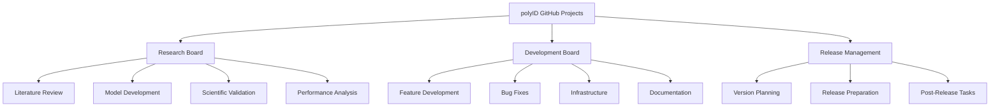

# GitHub Projects Setup Guide for polyID

## Overview

This guide provides comprehensive instructions for setting up GitHub Projects V2 for the polyID polymer property prediction microservice. The setup is designed to balance research and development workflows while supporting open source collaboration.

## Table of Contents

1. [Project Architecture](#project-architecture)
2. [Quick Setup Guide](#quick-setup-guide)
3. [Project Board Templates](#project-board-templates)
4. [Workflow Automation](#workflow-automation)
5. [Integration with Existing Infrastructure](#integration-with-existing-infrastructure)
6. [Team Collaboration Setup](#team-collaboration-setup)
7. [Error Monitoring & Tracking](#error-monitoring--tracking)
8. [Maintenance Guidelines](#maintenance-guidelines)

## Project Architecture

### Multi-Board Strategy

We recommend a **dual-board architecture** to separate research and development concerns:



### Board Structure Overview

| Board | Purpose | Primary Users | Workflow Type |
|-------|---------|---------------|---------------|
| **Research Board** | Scientific discovery, model development, validation | Researchers, ML Engineers | Kanban with research phases |
| **Development Board** | Feature development, bug fixes, infrastructure | Developers, Contributors | Sprint-based development |
| **Release Management** | Version planning, release coordination | Project Maintainers | Milestone-driven |

## Quick Setup Guide

### Prerequisites

1. **Repository Access**: Admin permissions to the polyID repository
2. **GitHub Projects V2**: Ensure Projects V2 is enabled for your organization
3. **Existing Infrastructure**: This guide integrates with your current:
   - Issue templates ([`bug_report.md`](.github/ISSUE_TEMPLATE/bug_report.md), [`feature_request.md`](.github/ISSUE_TEMPLATE/feature_request.md))
   - CI/CD workflows ([`ci.yml`](.github/workflows/ci.yml), [`pypi_publish.yml`](.github/workflows/pypi_publish.yml))
   - Wiki documentation

### Step 1: Create Projects

1. Navigate to your repository on GitHub
2. Click the "Projects" tab
3. Click "Link a project" → "New project"
4. Create three projects using the templates below

### Step 2: Configure Board Templates

Use the detailed templates in the [Project Board Templates](#project-board-templates) section below.

### Step 3: Set Up Automation

Configure the workflow automations described in the [Workflow Automation](#workflow-automation) section.

### Step 4: Link with Existing Issues

Import existing issues and PRs into appropriate projects using the bulk selection feature.

## Project Board Templates

### 1. Research Board Template

#### Purpose
Track scientific research, model development, and validation activities.

#### Board Configuration

**Views:**
- **Kanban Board**: Primary research workflow
- **Research Table**: Detailed view with custom fields
- **Timeline**: Research milestone tracking

**Custom Fields:**
```yaml
Research Phase:
  type: select
  options:
    - Literature Review
    - Data Collection
    - Model Development
    - Validation
    - Analysis
    - Publication

Research Priority:
  type: select
  options:
    - Critical
    - High
    - Medium
    - Low

Complexity:
  type: select
  options:
    - Simple (1-3 days)
    - Moderate (1-2 weeks)
    - Complex (2-4 weeks)
    - Research Project (1-3 months)

Model Type:
  type: select
  options:
    - Neural Network
    - Feature Engineering
    - Preprocessing
    - Validation Method
    - Performance Optimization

Scientific Impact:
  type: select
  options:
    - High (Novel discovery)
    - Medium (Improvement)
    - Low (Maintenance)

Validation Status:
  type: select
  options:
    - Not Started
    - In Progress
    - Peer Review
    - Validated
    - Published
```

**Column Structure:**
1. **📚 Literature Review** - Background research and state-of-the-art analysis
2. **🔬 Hypothesis/Design** - Research questions and experimental design
3. **🧪 Development** - Active model/algorithm development
4. **📊 Validation** - Testing, validation, and analysis
5. **✅ Validated** - Scientifically validated results
6. **📝 Documentation** - Write-up and publication

#### Research Workflow Labels

Create these labels specifically for research tracking:
- `research:literature` - Literature review tasks
- `research:modeling` - ML model development
- `research:validation` - Scientific validation
- `research:analysis` - Data analysis and interpretation
- `research:publication` - Documentation and publication
- `impact:high` - High scientific impact
- `complexity:research` - Long-term research projects

### 2. Development Board Template

#### Purpose
Manage software development, bug fixes, and infrastructure improvements.

#### Board Configuration

**Views:**
- **Sprint Board**: 2-week development sprints
- **Development Table**: Feature tracking with technical details
- **Bug Triage**: Bug prioritization and assignment

**Custom Fields:**
```yaml
Development Type:
  type: select
  options:
    - Feature
    - Bug Fix
    - Infrastructure
    - Documentation
    - Performance
    - Security

Sprint:
  type: select
  options:
    - Backlog
    - Current Sprint
    - Next Sprint
    - Future

Technical Complexity:
  type: select
  options:
    - Low (< 1 day)
    - Medium (1-3 days)
    - High (3-7 days)
    - Epic (> 1 week)

Component:
  type: select
  options:
    - Core ML (polyid/)
    - Interface (app.py)
    - Performance (optimizations)
    - Testing (tests/)
    - Documentation (docs/)
    - Infrastructure (.github/)
    - Deployment (Docker/HF)

Review Status:
  type: select
  options:
    - Draft
    - Ready for Review
    - In Review
    - Approved
    - Merged

Testing Required:
  type: select
  options:
    - Unit Tests
    - Integration Tests
    - Performance Tests
    - Manual Testing
    - No Testing
```

**Column Structure:**
1. **📋 Backlog** - Prioritized development tasks
2. **🎯 Ready** - Tasks ready for development
3. **🔨 In Progress** - Active development
4. **🔍 Code Review** - Awaiting/in code review
5. **🧪 Testing** - QA and testing phase
6. **✅ Done** - Completed and merged

### 3. Release Management Board Template

#### Purpose
Coordinate releases, version planning, and post-release activities.

#### Board Configuration

**Views:**
- **Release Timeline**: Roadmap view of upcoming releases
- **Version Table**: Detailed release planning
- **Release Board**: Current release status

**Custom Fields:**
```yaml
Release Version:
  type: select
  options:
    - v1.1.0 (Next Patch)
    - v1.2.0 (Next Minor)
    - v2.0.0 (Next Major)
    - Future

Release Type:
  type: select
  options:
    - Patch (Bug fixes)
    - Minor (New features)
    - Major (Breaking changes)

Release Priority:
  type: select
  options:
    - Critical (Hotfix)
    - High (Planned)
    - Medium (Enhancement)
    - Low (Nice-to-have)

Deployment Target:
  type: select
  options:
    - PyPI
    - TestPyPI
    - GitHub Release
    - HF Spaces
    - Docker Hub

Release Status:
  type: select
  options:
    - Planning
    - Development
    - Testing
    - Release Candidate
    - Released
    - Post-Release
```

**Column Structure:**
1. **📋 Planning** - Release planning and scoping
2. **🔨 Development** - Features in development for release
3. **🧪 Testing** - Release candidate testing
4. **🚀 Ready to Release** - Prepared for release
5. **✅ Released** - Successfully released
6. **📊 Post-Release** - Post-release monitoring and fixes

## Workflow Automation

### Automated Actions Setup

#### 1. Issue Routing Automation

```yaml
# Auto-assign to appropriate board based on labels
name: Route Issues to Projects
on:
  issues:
    types: [opened, labeled]

jobs:
  route_issue:
    runs-on: ubuntu-latest
    steps:
      - name: Route to Research Board
        if: contains(github.event.issue.labels.*.name, 'research') || contains(github.event.issue.labels.*.name, 'enhancement')
        uses: actions/add-to-project@v0.4.0
        with:
          project-url: https://github.com/users/USERNAME/projects/RESEARCH_PROJECT_NUMBER
          github-token: ${{ secrets.ADD_TO_PROJECT_PAT }}

      - name: Route to Development Board
        if: contains(github.event.issue.labels.*.name, 'bug') || contains(github.event.issue.labels.*.name, 'documentation')
        uses: actions/add-to-project@v0.4.0
        with:
          project-url: https://github.com/users/USERNAME/projects/DEVELOPMENT_PROJECT_NUMBER
          github-token: ${{ secrets.ADD_TO_PROJECT_PAT }}
```

#### 2. PR Integration Automation

```yaml
# Auto-move items based on PR status
name: Project PR Integration
on:
  pull_request:
    types: [opened, closed, ready_for_review]

jobs:
  update_project:
    runs-on: ubuntu-latest
    steps:
      - name: Move to Review on PR Open
        if: github.event.action == 'ready_for_review'
        uses: actions/add-to-project@v0.4.0
        with:
          project-url: https://github.com/users/USERNAME/projects/DEVELOPMENT_PROJECT_NUMBER
          github-token: ${{ secrets.ADD_TO_PROJECT_PAT }}

      - name: Move to Done on PR Merge
        if: github.event.pull_request.merged == true
        # Update project item status to "Done"
        run: |
          echo "PR merged - update project status to Done"
          # Additional automation logic here
```

#### 3. CI/CD Integration

Integrate with existing [`ci.yml`](.github/workflows/ci.yml):

```yaml
# Add to existing CI workflow
- name: Update Project on CI Failure
  if: failure()
  uses: actions/add-to-project@v0.4.0
  with:
    project-url: https://github.com/users/USERNAME/projects/DEVELOPMENT_PROJECT_NUMBER
    github-token: ${{ secrets.ADD_TO_PROJECT_PAT }}
    # Set custom field to indicate CI failure
```

### Manual Automation Rules

Set up these automation rules in GitHub Projects:

1. **When issue is labeled "bug"**: Move to Development Board → "Backlog"
2. **When issue is labeled "enhancement"**: Move to Research Board → "Literature Review"
3. **When PR is opened**: Move to Development Board → "Code Review"
4. **When PR is merged**: Move to Development Board → "Done"
5. **When issue is closed**: Archive item after 30 days

## Integration with Existing Infrastructure

### Issue Template Integration

Your existing issue templates already include excellent metadata that Projects can utilize:

#### Bug Report Integration ([`bug_report.md`](.github/ISSUE_TEMPLATE/bug_report.md))
- **Auto-routing**: Bugs automatically go to Development Board
- **Environment data**: Populated into custom fields
- **Component identification**: Maps to Development Board's Component field

#### Feature Request Integration ([`feature_request.md`](.github/ISSUE_TEMPLATE/feature_request.md))
- **Research vs Development**: Use problem statement to determine board routing
- **Impact assessment**: Maps to Scientific Impact field for research items

### CI/CD Workflow Integration

#### Current CI Workflow ([`ci.yml`](.github/workflows/ci.yml))
Enhance with project integration:
```yaml
# Add to test job
- name: Update Project on Test Failure
  if: failure()
  run: |
    # Create high-priority bug in Development Board
    # Set status to "Ready" for immediate attention
```

#### Publishing Workflow ([`pypi_publish.yml`](.github/workflows/pypi_publish.yml))
```yaml
# Add to successful publish
- name: Update Release Board
  if: success()
  run: |
    # Move release items to "Released" status
    # Create post-release monitoring tasks
```

### Wiki Integration

Link project boards with wiki documentation:
- [Home.md](.github/wiki/Home.md): Add project status dashboard
- [Contributing.md](.github/wiki/Contributing.md): Reference project boards for contribution workflow

## Team Collaboration Setup

### Role-Based Access

#### Repository Maintainers
- **Access**: All project boards (Read/Write)
- **Responsibilities**: 
  - Release planning and coordination
  - Research direction and validation
  - Community management

#### Core Contributors
- **Access**: Research and Development boards (Write)
- **Responsibilities**:
  - Feature development
  - Research implementation
  - Code review and testing

#### Community Contributors
- **Access**: Development board (Read), specific assigned items (Write)
- **Responsibilities**:
  - Bug fixes and small features
  - Documentation improvements
  - Testing and feedback

### Contribution Workflow

1. **New Contributors**:
   ```
   Issue Creation → Auto-routing → Board Assignment → Contributor Assignment
   ```

2. **Research Contributors**:
   ```
   Research Proposal → Literature Review → Hypothesis → Development → Validation → Publication
   ```

3. **Feature Contributors**:
   ```
   Feature Request → Planning → Development → Code Review → Testing → Release
   ```

### Communication Integration

#### GitHub Discussions Integration
- Link project items to GitHub Discussions for detailed technical discussions
- Use discussions for research planning and community feedback

#### Milestone Alignment
- Research Milestones: Scientific validation, publication deadlines
- Development Milestones: Version releases, performance targets
- Integration Milestones: PaleoBond-PCP compatibility updates

## Error Monitoring & Tracking

### Performance Issue Tracking

Based on your performance optimization features ([`performance_monitor.py`](polyid/performance_monitor.py), [`cache_manager.py`](polyid/cache_manager.py)):

#### Custom Fields for Performance Issues
```yaml
Performance Category:
  type: select
  options:
    - Cache Performance
    - Prediction Speed
    - Memory Usage
    - Async Processing
    - Molecular Visualization

Performance Impact:
  type: select
  options:
    - Critical (System failure)
    - High (User experience)
    - Medium (Optimization)
    - Low (Nice-to-have)

Monitoring Source:
  type: select
  options:
    - User Report
    - Automated Alert
    - Performance Testing
    - CI/CD Pipeline
```

### Error Tracking Automation

#### CI/CD Failure Tracking
```yaml
# Workflow to create project items for CI failures
name: Create Project Item for CI Failure
on:
  workflow_run:
    workflows: ["CI"]
    types: [completed]
    conclusions: [failure]

jobs:
  create_failure_item:
    runs-on: ubuntu-latest
    steps:
      - name: Create Bug Report
        uses: actions/create-issue@v1
        with:
          title: "CI Failure: ${{ github.workflow }} - ${{ github.run_id }}"
          body: |
            **Automated Bug Report**
            
            CI workflow failed for commit ${{ github.sha }}
            
            **Details:**
            - Workflow: ${{ github.workflow }}
            - Run ID: ${{ github.run_id }}
            - Branch: ${{ github.ref }}
            
            **Next Steps:**
            - Review build logs
            - Identify root cause
            - Implement fix
            - Verify fix with tests
          labels: bug,ci-failure,priority:high
```

### Performance Monitoring Dashboard

Create a dedicated project view for performance tracking:

1. **Performance Issues View**:
   - Filter: `label:performance OR label:bug`
   - Sort: Priority, then created date
   - Custom fields: Performance Category, Impact, Resolution Time

2. **System Health View**:
   - Track performance optimization tasks
   - Monitor deployment health
   - Track integration issues with PaleoBond-PCP

## Maintenance Guidelines

### Regular Maintenance Tasks

#### Weekly
- **Review Board Health**: Ensure items are moving through columns appropriately
- **Update Milestones**: Adjust research and development milestone dates
- **Performance Review**: Check for stuck items or bottlenecks

#### Monthly
- **Archive Completed Items**: Move old completed items to archived state
- **Label Audit**: Review and clean up label usage
- **Automation Review**: Verify automation rules are working correctly

#### Quarterly
- **Board Structure Review**: Evaluate if board structure meets current needs
- **Field Updates**: Update custom fields based on project evolution
- **Integration Assessment**: Review integration with CI/CD and other tools

### Optimization Guidelines

#### Board Performance
- **Item Limits**: Keep active items under 50 per board for optimal performance
- **View Optimization**: Create focused views for specific use cases
- **Field Management**: Regular audit of custom fields to avoid bloat

#### Workflow Efficiency
- **Automation Tuning**: Regular review and optimization of automation rules
- **Integration Health**: Monitor and maintain integrations with CI/CD
- **User Training**: Regular training sessions for team members

### Backup and Recovery

#### Project Backup Strategy
```bash
# Use GitHub CLI to backup project data
gh project list --owner USERNAME --format json > projects_backup.json
gh project item-list PROJECT_NUMBER --format json > project_items_backup.json
```

#### Recovery Procedures
1. **Project Recreation**: Step-by-step recreation process
2. **Data Import**: Bulk import procedures for items and fields
3. **Automation Restore**: Restoration of workflow automations

### Metrics and Analytics

#### Key Performance Indicators (KPIs)

**Research Board KPIs:**
- Average time in each research phase
- Research-to-publication success rate
- Scientific impact assessment accuracy

**Development Board KPIs:**
- Average cycle time (Backlog → Done)
- Bug resolution time
- Feature delivery velocity

**Release Management KPIs:**
- Release frequency
- Post-release issue rate
- Deployment success rate

#### Monitoring Setup
```yaml
# Example automation for KPI collection
name: Collect Project Metrics
on:
  schedule:
    - cron: '0 0 * * 1' # Weekly on Monday
  
jobs:
  collect_metrics:
    runs-on: ubuntu-latest
    steps:
      - name: Generate Project Metrics Report
        run: |
          # Collect project data using GitHub API
          # Generate metrics report
          # Store in project wiki or discussions
```

## Templates and Quick Start Scripts

### Project Creation Script

```bash
#!/bin/bash
# create_polyid_projects.sh

echo "Creating polyID GitHub Projects..."

# Create Research Board
gh project create --owner "$GITHUB_OWNER" --title "polyID Research Board" \
  --body "Scientific research, model development, and validation tracking"

# Create Development Board  
gh project create --owner "$GITHUB_OWNER" --title "polyID Development Board" \
  --body "Feature development, bug fixes, and infrastructure management"

# Create Release Management Board
gh project create --owner "$GITHUB_OWNER" --title "polyID Release Management" \
  --body "Version planning, release coordination, and post-release activities"

echo "Projects created successfully!"
echo "Next steps:"
echo "1. Configure custom fields using the templates in this guide"
echo "2. Set up automation rules"
echo "3. Import existing issues and PRs"
```

### Field Configuration Templates

Save these as `.github/project-templates/` for quick setup:

```yaml
# research_board_fields.yml
fields:
  - name: "Research Phase"
    type: "single_select"
    options:
      - "Literature Review"
      - "Data Collection"
      - "Model Development"
      - "Validation"
      - "Analysis"
      - "Publication"
  
  - name: "Scientific Impact"
    type: "single_select"
    options:
      - "High (Novel discovery)"
      - "Medium (Improvement)"
      - "Low (Maintenance)"
```

## Integration with PaleoBond-PCP

Since polyID is a microservice supporting PaleoBond-PCP, consider these additional integrations:

### Cross-Repository Coordination

1. **Dependency Tracking**: Create items for PaleoBond-PCP compatibility updates
2. **Version Synchronization**: Align release schedules with main project needs
3. **API Stability**: Track breaking changes that might affect the main project

### Communication Channels

1. **Status Updates**: Regular status reports to PaleoBond-PCP maintainers
2. **Integration Testing**: Coordinate testing cycles with main project
3. **Release Coordination**: Ensure polyID releases align with PaleoBond-PCP needs

---

## Summary

This GitHub Projects setup provides:

- ✅ **Dual-board architecture** balancing research and development workflows
- ✅ **Seamless integration** with existing CI/CD, issue templates, and documentation
- ✅ **Comprehensive automation** for issue routing, PR tracking, and error monitoring
- ✅ **Open source collaboration** features for community contributors
- ✅ **Performance monitoring** integration with existing optimization features
- ✅ **Maintenance guidelines** for long-term sustainability

The setup is specifically designed for a Python ML research project serving as a microservice, providing the structure needed for both scientific discovery and reliable software development.

For questions or customization needs, refer to the [maintenance guidelines](#maintenance-guidelines) or create an issue using the existing [issue templates](.github/ISSUE_TEMPLATE/).