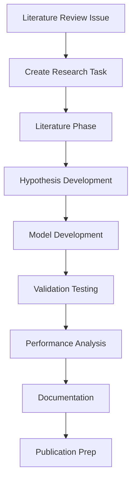
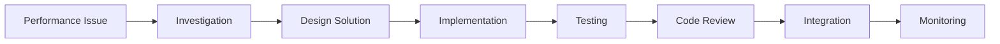
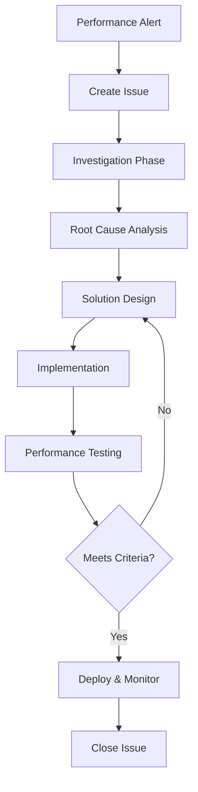
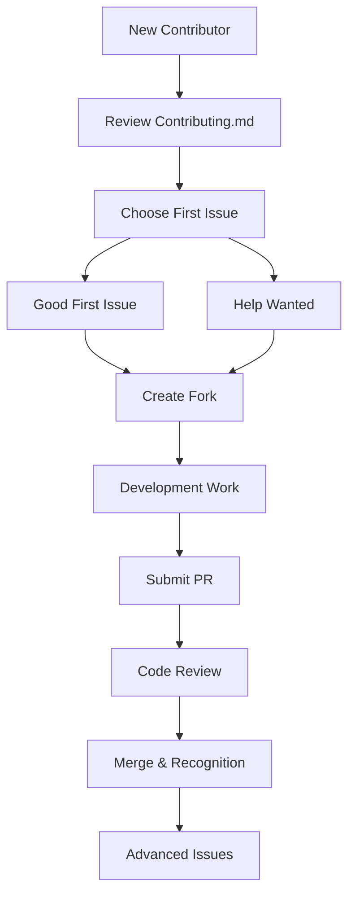

# GitHub Projects Best Practices for polyID

This document provides practical examples, best practices, and daily usage patterns for the polyID GitHub Projects setup, specifically tailored for ML research microservices.

## Table of Contents

1. [Daily Workflow Examples](#daily-workflow-examples)
2. [Research Project Management](#research-project-management)
3. [Development Best Practices](#development-best-practices)
4. [Integration Patterns](#integration-patterns)
5. [Performance Optimization Workflow](#performance-optimization-workflow)
6. [Community Management](#community-management)
7. [Troubleshooting Common Issues](#troubleshooting-common-issues)

## Daily Workflow Examples

### 1. Starting Your Day: Project Board Review

**Morning Routine Checklist:**
```markdown
## Daily Project Review (5 minutes)
- [ ] Check [Project Dashboard](.github/PROJECT_DASHBOARD.md) for overnight alerts
- [ ] Review assigned items across all boards
- [ ] Check CI/CD status for any failures
- [ ] Update status of items you're working on
- [ ] Identify blockers or dependencies
```

**Quick Board Scan:**
1. **Research Board**: Check validation status, new literature to review
2. **Development Board**: Review PR status, test failures, new bugs
3. **Release Management**: Check upcoming deadlines, deployment status

### 2. Research Workflow Example

**Scenario**: Starting a new polymer property prediction model



**Step-by-step Process:**

1. **Create Literature Review Issue**:
   ```markdown
   Title: Literature Review - Enhanced Graph Neural Networks for Polymers
   
   Labels: research:literature, priority:medium
   Project: Research Board
   
   **Research Scope:**
   - Recent GNN advances in molecular prediction
   - Polymer-specific neural architectures
   - Performance benchmarks in chemistry ML
   
   **Deliverables:**
   - [ ] Summary of 15-20 key papers
   - [ ] Gap analysis for current polyID models
   - [ ] Recommendations for model improvements
   
   **Timeline:** 1 week
   **Research Phase:** Literature Review
   ```

2. **Transition to Model Development**:
   - Update Research Phase field: `Literature Review` → `Model Development`
   - Create linked development issues for implementation
   - Set up validation metrics and success criteria

3. **Performance Integration**:
   - Link to performance monitoring issues
   - Set up automated benchmarking
   - Create validation test cases

### 3. Development Workflow Example

**Scenario**: Implementing cache performance improvements



**Implementation Process:**

1. **Issue Creation from Performance Alert**:
   ```markdown
   Title: Cache Hit Rate Below 60% - Performance Degradation
   
   Labels: bug, performance, priority:high
   Project: Development Board
   
   **Automated Performance Report:**
   - Current Cache Hit Rate: 45%
   - Target: >60%
   - Performance Impact: 25% slower predictions
   
   **Investigation Steps:**
   - [ ] Review cache implementation in cache_manager.py
   - [ ] Analyze cache eviction patterns
   - [ ] Check memory constraints
   - [ ] Profile cache key generation
   
   **Success Criteria:**
   - [ ] Cache hit rate >60%
   - [ ] No memory leaks
   - [ ] Performance tests pass
   ```

2. **Development Tracking**:
   - Move through Development Board columns
   - Link to related performance monitoring issues
   - Update custom fields (Component: Performance, Complexity: Medium)

3. **Integration with CI/CD**:
   - Automated testing triggers project updates
   - Performance benchmarks update project status
   - Failed tests create linked issues

## Research Project Management

### Long-term Research Planning

**Quarterly Research Planning Template:**

```markdown
# Q1 2024 Research Plan - polyID Model Improvements

## Strategic Objectives
1. **Primary**: Improve prediction accuracy by 15%
2. **Secondary**: Reduce inference time by 30%
3. **Innovation**: Explore domain adaptation techniques

## Research Milestones

### Month 1: Foundation
- [ ] Literature review - GNN advances
- [ ] Baseline performance assessment
- [ ] Data preprocessing improvements

### Month 2: Development  
- [ ] Enhanced neural architecture design
- [ ] Feature engineering experiments
- [ ] Initial model training

### Month 3: Validation
- [ ] Cross-validation studies
- [ ] Domain of validity analysis
- [ ] Performance benchmarking

## Resource Allocation
- **Literature Review**: 20% (ongoing)
- **Model Development**: 50%
- **Validation & Testing**: 25%
- **Documentation**: 5%

## Success Metrics
- [ ] 15+ papers reviewed and summarized
- [ ] 3 model variants developed and tested
- [ ] 95% confidence in validation results
- [ ] 1 conference paper submitted
```

### Research Issue Templates

**Model Development Issue Template:**
```markdown
## Model Development: [Model Name]

**Research Phase**: Model Development
**Scientific Impact**: High (Novel discovery)
**Complexity**: Research Project (1-3 months)

### Background
Brief description of the model approach and expected improvements.

### Technical Specifications
- **Architecture**: [e.g., Message-passing GNN with attention]
- **Input Features**: [e.g., Molecular graphs, polymer descriptors]
- **Target Properties**: [e.g., Tg, Tm, mechanical properties]

### Development Milestones
- [ ] Architecture design and documentation
- [ ] Initial implementation in polyid/models/
- [ ] Unit tests for model components
- [ ] Integration with existing pipeline
- [ ] Baseline performance evaluation
- [ ] Hyperparameter optimization
- [ ] Cross-validation studies

### Validation Requirements
- [ ] Performance vs. existing models
- [ ] Domain of validity analysis
- [ ] Statistical significance testing
- [ ] Computational efficiency assessment

### Integration Checklist
- [ ] Compatible with cache_manager.py
- [ ] Works with async_processor.py
- [ ] Integrates with performance_monitor.py
- [ ] Updates enhanced_interface.py displays

### Documentation
- [ ] Model architecture documentation
- [ ] API documentation updates
- [ ] Performance benchmarks
- [ ] Usage examples
```

## Development Best Practices

### Code Quality Integration

**Pre-commit Hook Integration:**
```yaml
# .pre-commit-config.yaml addition
repos:
  - repo: local
    hooks:
      - id: update-project-status
        name: Update GitHub Projects
        entry: python scripts/update_project_status.py
        language: python
        pass_filenames: false
```

**Code Review Process with Projects:**

1. **PR Creation Automation**:
   - Auto-adds PR to Development Board
   - Sets status to "Code Review"
   - Links to related issues
   - Updates custom fields

2. **Review Process Tracking**:
   ```markdown
   ## Code Review Checklist
   
   **Technical Review:**
   - [ ] Code follows polyID style guidelines
   - [ ] Tests cover new functionality
   - [ ] Performance impact assessed
   - [ ] Documentation updated
   
   **Project Integration:**
   - [ ] Related project items updated
   - [ ] Performance monitoring considerations
   - [ ] Integration with existing features verified
   
   **Research Validation:**
   - [ ] Scientific approach validated
   - [ ] Results reproducible
   - [ ] Domain of validity considered
   ```

### Performance-Driven Development

**Performance Issue Workflow:**



**Performance Monitoring Integration:**
```python
# Example integration in polyid/performance_monitor.py
def create_performance_issue_if_needed():
    """Create GitHub issue for performance problems"""
    metrics = get_current_metrics()
    
    if metrics['cache_hit_rate'] < 0.6:
        create_project_issue(
            title=f"Cache Performance Degradation - Hit Rate: {metrics['cache_hit_rate']:.1%}",
            labels=['performance', 'automated', 'priority:medium'],
            board='development',
            custom_fields={
                'Component': 'Performance (optimizations)',
                'Technical Complexity': 'Medium (1-3 days)',
                'Development Type': 'Performance'
            }
        )
```

## Integration Patterns

### PaleoBond-PCP Coordination

**Cross-Project Issue Template:**
```markdown
## PaleoBond-PCP Integration: [Feature/Change]

**Integration Type**: [API Change / Performance Update / Bug Fix]
**polyID Version**: [Current/Target Version]
**PaleoBond-PCP Impact**: [High/Medium/Low]

### Changes Summary
Brief description of changes that affect the main project.

### Compatibility Assessment
- [ ] API backward compatibility maintained
- [ ] Performance characteristics unchanged
- [ ] New features properly exposed
- [ ] Documentation updated

### Coordination Tasks
- [ ] Notify PaleoBond-PCP maintainers
- [ ] Schedule integration testing
- [ ] Coordinate release timing
- [ ] Update dependency specifications
- [ ] Test deployment compatibility

### Testing Requirements
- [ ] polyID unit tests pass
- [ ] Integration tests with PaleoBond-PCP
- [ ] Performance benchmarks maintained
- [ ] End-to-end functionality verified

**Communication:**
- PaleoBond-PCP Issue: [Link when created]
- Discussion Thread: [Link to coordination discussion]
- Release Coordination: [Timeline and dependencies]
```

### CI/CD Integration Patterns

**Automated Project Updates:**
```yaml
# Example workflow integration
- name: Update Projects on Test Results
  if: always()
  uses: actions/github-script@v6
  with:
    script: |
      const testStatus = '${{ job.status }}';
      const projectItems = await getRelatedProjectItems(context.sha);
      
      for (const item of projectItems) {
        if (testStatus === 'failure') {
          await updateProjectItem(item.id, {
            status: 'Needs Review',
            customFields: {
              'Review Status': 'Failed Tests'
            }
          });
        } else if (testStatus === 'success') {
          await updateProjectItem(item.id, {
            customFields: {
              'Review Status': 'Tests Passing'
            }
          });
        }
      }
```

## Performance Optimization Workflow

### Systematic Performance Improvement

**Performance Optimization Project Template:**
```markdown
# Performance Optimization Sprint - [Focus Area]

## Current Performance Baseline
- **Prediction Time**: [Current average]
- **Memory Usage**: [Current average] 
- **Cache Hit Rate**: [Current rate]
- **Throughput**: [Predictions/second]

## Optimization Targets
- **Prediction Time**: Reduce by 30%
- **Memory Usage**: Reduce by 20%
- **Cache Hit Rate**: Increase to >80%
- **Throughput**: Increase by 50%

## Investigation Areas
### High Impact, Low Effort
- [ ] Cache key optimization
- [ ] Memory pool tuning
- [ ] Query optimization

### High Impact, High Effort  
- [ ] Algorithm optimization
- [ ] Architecture refactoring
- [ ] Parallel processing

### Monitoring & Validation
- [ ] Benchmark test suite
- [ ] Performance regression tests
- [ ] Production monitoring setup
```

### Performance Issue Prioritization Matrix

| Issue Type | User Impact | Fix Complexity | Priority | Timeline |
|------------|-------------|----------------|----------|----------|
| Memory Leak | Critical | High | P0 | Immediate |
| Slow Cache | High | Medium | P1 | This Sprint |
| UI Lag | Medium | Low | P2 | Next Sprint |
| Batch Processing | Low | High | P3 | Backlog |

## Community Management

### Contributor Onboarding

**New Contributor Workflow:**


**Good First Issue Criteria:**
- Clear requirements and acceptance criteria
- Well-defined scope (< 4 hours of work)
- Good documentation and context
- Not blocking other development
- Includes learning opportunities

**Issue Template for Contributors:**
```markdown
## Good First Issue: [Simple Task]

**Estimated Time**: 2-4 hours
**Skills Needed**: Python, Basic ML understanding
**Learning Outcomes**: polyID codebase, Testing practices

### Task Description
Clear description of what needs to be done.

### Acceptance Criteria
- [ ] Specific requirement 1
- [ ] Specific requirement 2
- [ ] Tests added/updated
- [ ] Documentation updated

### Getting Started
1. Fork the repository
2. Set up development environment using [Installation.md](.github/wiki/Installation.md)
3. Check out existing code in [relevant file/directory]
4. Run tests with `pytest tests/`

### Resources
- [Related documentation](link)
- [Similar implementation](link)
- [Test examples](link)

### Mentorship
@maintainer-name will provide guidance and code review.
```

### Community Issue Management

**Issue Triage Process:**
1. **Daily Triage** (10 minutes):
   - Label new issues appropriately
   - Route to correct project board
   - Assign to team members or mark for community

2. **Weekly Community Review**:
   - Review community contributions
   - Update "help wanted" issues
   - Recognize contributors
   - Plan mentorship activities

## Troubleshooting Common Issues

### Project Board Issues

**Issue**: Items not moving between columns automatically
**Solution**:
```bash
# Check automation rules
gh project rule-list PROJECT_NUMBER

# Verify webhook delivery
gh api repos/OWNER/REPO/hooks/HOOK_ID/deliveries

# Test automation manually
gh project item-edit PROJECT_NUMBER ITEM_ID --field-id STATUS_FIELD_ID --text "New Status"
```

**Issue**: Performance alerts not creating issues
**Solution**:
```python
# Check performance monitoring integration
from polyid.performance_monitor import get_performance_monitor
monitor = get_performance_monitor()
print(monitor.get_current_metrics())

# Verify GitHub token and permissions
import os
print(os.environ.get('ADD_TO_PROJECT_PAT', 'Not set'))
```

**Issue**: Research items stuck in one phase
**Solution**:
- Review research workflow process
- Check if validation criteria are too strict
- Consider breaking large research items into smaller tasks
- Update Research Phase field definitions if needed

### Integration Issues

**Issue**: CI/CD not updating project status
**Solution**:
1. Verify GitHub Actions permissions
2. Check project automation workflow syntax
3. Test project API endpoints manually
4. Review project number references in workflows

**Issue**: PaleoBond-PCP coordination problems
**Solution**:
1. Create explicit communication issues
2. Set up regular sync meetings
3. Use GitHub Discussions for coordination
4. Implement dependency tracking

### Performance Monitoring Issues

**Issue**: False positive performance alerts
**Solution**:
```yaml
# Adjust alert thresholds in performance monitoring
performance_thresholds:
  memory_usage_alert: 85  # Increase from 80
  prediction_time_alert: 6.0  # Increase from 5.0
  cache_hit_rate_alert: 55  # Decrease from 60
  
# Add alert dampening
alert_dampening:
  min_duration: 300  # 5 minutes
  min_occurrences: 3  # Multiple occurrences needed
```

**Issue**: Research metrics not tracking properly
**Solution**:
1. Review custom field definitions
2. Check data entry consistency
3. Automate more metric collection
4. Create data validation rules

## Quick Reference Commands

### GitHub CLI Commands
```bash
# List all projects
gh project list --owner USERNAME

# View project details
gh project view PROJECT_NUMBER

# Add issue to project
gh project item-add PROJECT_NUMBER --url ISSUE_URL

# Update project item
gh project item-edit PROJECT_NUMBER ITEM_ID --field-id FIELD_ID --text "New Value"

# List project items
gh project item-list PROJECT_NUMBER --format json

# Create new project
gh project create --owner USERNAME --title "Project Name"
```

### Project Management Shortcuts
```bash
# Daily standup data
gh issue list --assignee @me --state open --json title,url,labels

# Sprint planning
gh project item-list DEVELOPMENT_PROJECT_NUMBER --format json | jq '.[] | select(.status == "Ready")'

# Performance check
python -c "from polyid.performance_monitor import get_performance_monitor; print(get_performance_monitor().get_current_metrics())"

# Research progress
gh project item-list RESEARCH_PROJECT_NUMBER --format json | jq '.[] | select(.research_phase == "Validation")'
```

### Automation Testing
```bash
# Test issue routing
gh issue create --title "Test Bug" --label bug --body "Test automation"

# Test PR integration  
gh pr create --title "Test PR" --body "Test automation" --draft

# Test performance alerts
python scripts/test_performance_alerts.py

# Validate project configuration
python scripts/validate_project_setup.py
```

---

## Best Practices Summary

✅ **Daily Habits**
- Check project dashboard each morning
- Update item status throughout the day
- Review and triage new issues promptly

✅ **Research Management**
- Break large research projects into manageable phases
- Link research items to development implementation
- Track validation status and scientific impact

✅ **Development Quality**
- Integrate project updates with CI/CD
- Use performance monitoring for proactive issue creation
- Maintain clear relationships between research and implementation

✅ **Community Engagement**
- Create good first issues regularly
- Provide mentorship and guidance
- Recognize and celebrate contributions

✅ **Performance Focus**
- Monitor performance metrics continuously
- Create performance issues proactively
- Link performance work to research validation

✅ **Integration Excellence**
- Coordinate closely with PaleoBond-PCP
- Maintain API compatibility
- Test integration scenarios regularly

This document should be regularly updated based on team experience and evolving project needs.