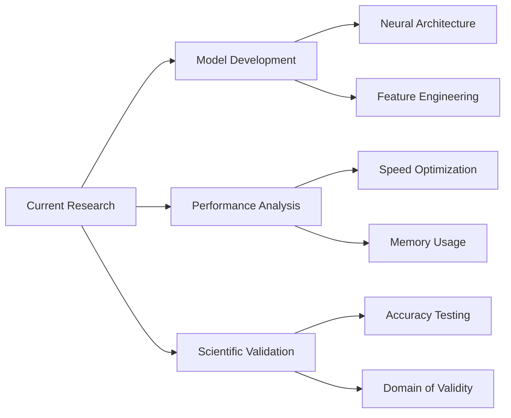
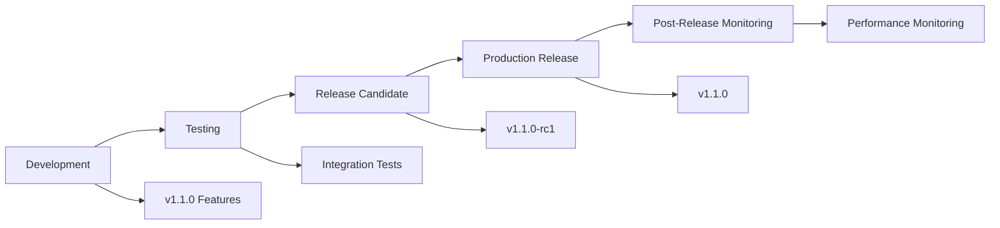
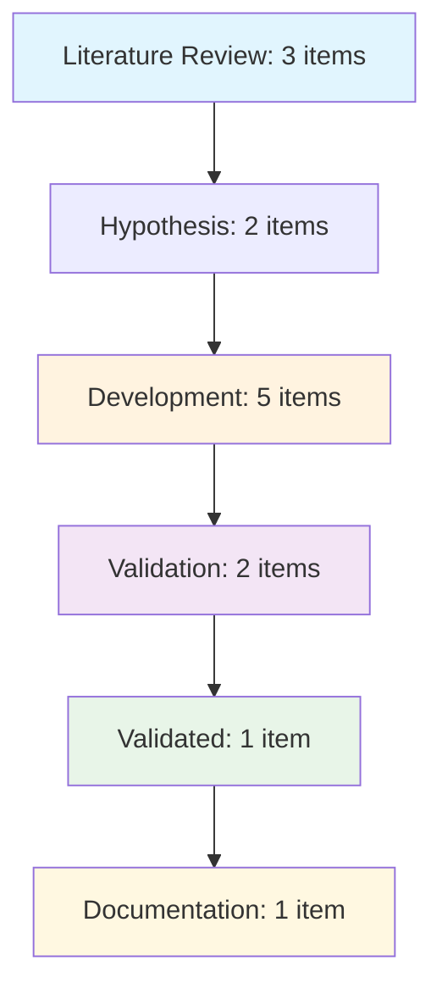
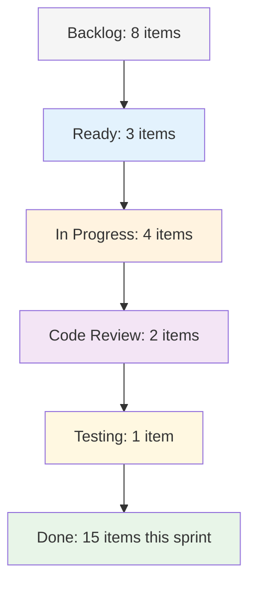
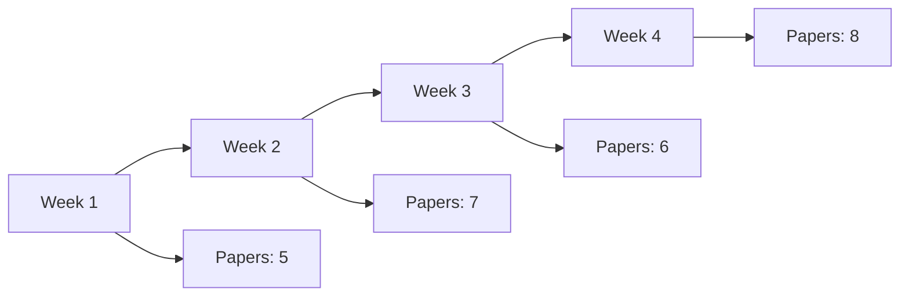

# polyID GitHub Projects Dashboard

This dashboard provides a centralized view of project health, progress tracking, and key metrics for the polyID polymer property prediction microservice.

## 📊 Project Health Overview

### Project Status Summary

| Board | Active Items | In Progress | Completed This Week | Health Status |
|-------|-------------|-------------|-------------------|---------------|
| Research Board | 🔢 | 🔢 | 🔢 | 🟢 Healthy |
| Development Board | 🔢 | 🔢 | 🔢 | 🟢 Healthy |
| Release Management | 🔢 | 🔢 | 🔢 | 🟢 Healthy |

*Last Updated: [Date] - Update this section weekly*

### Quick Links

- [🔬 Research Board](https://github.com/users/USERNAME/projects/RESEARCH_PROJECT_NUMBER)
- [💻 Development Board](https://github.com/users/USERNAME/projects/DEVELOPMENT_PROJECT_NUMBER)
- [🚀 Release Management](https://github.com/users/USERNAME/projects/RELEASE_PROJECT_NUMBER)
- [📋 All Projects Overview](https://github.com/USERNAME/polyID/projects)

## 🎯 Current Sprint Overview

### Research Focus Areas

### Development Priorities

| Priority | Feature/Task | Status | Assignee | Target Date |
|----------|-------------|--------|----------|-------------|
| 🔴 High | Performance optimization | In Progress | - | [Date] |
| 🟡 Medium | API enhancements | Planning | - | [Date] |
| 🟢 Low | Documentation updates | Backlog | - | [Date] |

### Release Pipeline

## 📈 Performance Metrics

### Research Productivity

| Metric | This Week | Last Week | Trend | Target |
|--------|-----------|-----------|-------|---------|
| Papers Reviewed | 🔢 | 🔢 | 📈 | 5/week |
| Models Developed | 🔢 | 🔢 | 📈 | 2/week |
| Experiments Completed | 🔢 | 🔢 | 📈 | 10/week |
| Validation Studies | 🔢 | 🔢 | 📈 | 3/week |

### Development Velocity

| Metric | This Sprint | Last Sprint | Trend | Target |
|--------|------------|-------------|-------|---------|
| Story Points Completed | 🔢 | 🔢 | 📈 | 20/sprint |
| Bugs Fixed | 🔢 | 🔢 | 📈 | 5/sprint |
| Features Delivered | 🔢 | 🔢 | 📈 | 3/sprint |
| Code Review Time (avg) | 🔢h | 🔢h | 📉 | <24h |

### System Health

| Component | Status | Last Check | Performance | Issues |
|-----------|--------|------------|-------------|---------|
| Core ML Engine | 🟢 Healthy | [Timestamp] | 95% | 0 open |
| Web Interface | 🟢 Healthy | [Timestamp] | 98% | 0 open |
| Performance Monitor | 🟢 Healthy | [Timestamp] | 92% | 0 open |
| Cache System | 🟡 Warning | [Timestamp] | 78% | 1 open |
| CI/CD Pipeline | 🟢 Healthy | [Timestamp] | 96% | 0 open |

## 🔄 Workflow Health Indicators

### Research Workflow

**Health Indicators:**
- ✅ Balanced distribution across phases
- ✅ Regular progression from research to validation
- ⚠️ Potential bottleneck in development phase

### Development Workflow

**Health Indicators:**
- ✅ Healthy backlog size
- ✅ Good work in progress balance
- ✅ Fast code review cycle

## 🎯 Milestone Tracking

### Research Milestones

| Milestone | Progress | Target Date | Status | Key Deliverables |
|-----------|----------|-------------|---------|------------------|
| Q1 Model Improvements | ████████░░ 80% | Mar 2024 | On Track | Enhanced GNN Architecture |
| Performance Baseline | ██████████ 100% | Feb 2024 | Complete | Benchmark Results |
| Scientific Validation | ██████░░░░ 60% | Apr 2024 | On Track | Peer Review Paper |

### Development Milestones  

| Milestone | Progress | Target Date | Status | Key Deliverables |
|-----------|----------|-------------|---------|------------------|
| v1.1.0 Release | ███████░░░ 70% | Mar 2024 | On Track | Performance Features |
| API Refactoring | ████░░░░░░ 40% | Apr 2024 | On Track | Improved Interface |
| HF Spaces Optimization | ██████████ 100% | Feb 2024 | Complete | Deployment Guide |

### PaleoBond-PCP Integration

| Integration Task | Progress | Status | Notes |
|------------------|----------|---------|-------|
| API Compatibility | ████████░░ 80% | In Progress | Version alignment needed |
| Performance Sync | ██████░░░░ 60% | Planning | Coordinate testing |
| Release Coordination | ████████░░ 80% | On Track | Timing confirmed |

## 🚨 Alerts & Action Items

### Critical Issues (🔴 High Priority)

- [ ] **Performance Degradation**: Cache hit rate below 60% - [Issue #XX](link)
- [ ] **CI Failure**: Tests failing on Python 3.11 - [Issue #XX](link)

### Warnings (🟡 Medium Priority)

- [ ] **Documentation**: API docs need updating for v1.1.0 - [Issue #XX](link)
- [ ] **Dependencies**: RDKit version compatibility check needed - [Issue #XX](link)

### Upcoming Deadlines (📅)

- **Mar 15**: Q1 Research Review Meeting
- **Mar 20**: v1.1.0 Feature Freeze
- **Mar 30**: v1.1.0 Release Candidate
- **Apr 5**: PaleoBond-PCP Integration Testing

## 📊 Contribution Analytics

### Top Contributors This Month

| Contributor | Commits | Issues Closed | PRs Merged | Research Items |
|-------------|---------|---------------|------------|---------------|
| [Name] | 🔢 | 🔢 | 🔢 | 🔢 |
| [Name] | 🔢 | 🔢 | 🔢 | 🔢 |
| [Name] | 🔢 | 🔢 | 🔢 | 🔢 |

### Community Engagement

| Metric | This Month | Last Month | Growth |
|---------|------------|------------|--------|
| New Contributors | 🔢 | 🔢 | +🔢% |
| Community Issues | 🔢 | 🔢 | +🔢% |
| Discussions Started | 🔢 | 🔢 | +🔢% |
| Wiki Page Views | 🔢 | 🔢 | +🔢% |

## 🔧 Project Maintenance Status

### Automation Health

| Automation | Status | Last Run | Success Rate | Action Needed |
|------------|--------|----------|--------------|---------------|
| Issue Routing | 🟢 Active | [Timestamp] | 95% | None |
| PR Integration | 🟢 Active | [Timestamp] | 98% | None |
| Performance Monitoring | 🟡 Warning | [Timestamp] | 85% | Review thresholds |
| Release Automation | 🟢 Active | [Timestamp] | 100% | None |

### Data Quality

| Data Source | Freshness | Completeness | Quality Score | Issues |
|-------------|-----------|--------------|---------------|---------|
| Issue Labels | Fresh (< 1h) | 95% | A | 2 unlabeled |
| Project Fields | Fresh (< 1h) | 88% | B+ | 5 missing fields |
| Milestone Data | Stale (> 24h) | 75% | B | Manual update needed |
| Performance Metrics | Fresh (< 30m) | 100% | A+ | None |

## 📋 Weekly Review Checklist

### Research Review
- [ ] Review research pipeline progress
- [ ] Update scientific impact assessments
- [ ] Check literature review queue
- [ ] Validate experimental results
- [ ] Update publication timeline

### Development Review
- [ ] Sprint progress assessment
- [ ] Code quality metrics review
- [ ] Bug triage and prioritization
- [ ] Performance benchmark checks
- [ ] Security update review

### Release Management
- [ ] Version planning updates
- [ ] Release timeline confirmation
- [ ] Deployment health checks
- [ ] PaleoBond-PCP coordination
- [ ] Community feedback review

### Project Health
- [ ] Update project metrics
- [ ] Review automation status
- [ ] Clean up completed items
- [ ] Update milestone progress
- [ ] Generate weekly report

## 🔄 Update Instructions

### Daily Updates (Automated)
- Performance metrics refresh every 30 minutes
- System health checks every hour
- Automation status updates every 2 hours

### Weekly Updates (Manual)
- Update project status summary
- Refresh milestone progress
- Review and update priorities
- Clean up completed items
- Update contribution analytics

### Monthly Updates (Manual)
- Comprehensive metrics review
- Automation optimization
- Project structure assessment
- Community engagement analysis
- Strategic planning updates

## 📈 Trend Analysis

### Research Productivity Trends

### Development Velocity Trends

## 🎯 Goals & Targets

### Short-term Goals (This Quarter)
- [ ] **Research**: Complete 3 major model improvements
- [ ] **Development**: Release v1.1.0 with performance features
- [ ] **Integration**: Achieve seamless PaleoBond-PCP compatibility
- [ ] **Community**: Onboard 5 new contributors

### Medium-term Goals (Next 6 Months)
- [ ] **Research**: Publish 2 peer-reviewed papers
- [ ] **Development**: Implement advanced ML features
- [ ] **Performance**: Achieve 50% speed improvement
- [ ] **Deployment**: Optimize for multiple platforms

### Long-term Goals (1 Year)
- [ ] **Research**: Establish as leading polymer prediction tool
- [ ] **Development**: Full microservices architecture
- [ ] **Community**: 100+ active contributors
- [ ] **Impact**: 1000+ research citations

---

## 📞 Support & Contact

**Project Maintainers:**
- Research Lead: [Name] - [Email]
- Development Lead: [Name] - [Email]
- Community Manager: [Name] - [Email]

**Quick Links:**
- [📋 Create New Issue](https://github.com/USERNAME/polyID/issues/new/choose)
- [💬 Start Discussion](https://github.com/USERNAME/polyID/discussions)
- [📖 Documentation](docs/README.md)
- [🚀 Deployment Guide](docs/deployment/DEPLOYMENT_GUIDE.md)

---

*Dashboard last updated: [Auto-generated timestamp]*
*Next scheduled update: [Date]*

**Usage Instructions:**
1. Update the USERNAME and project numbers in all links
2. Replace 🔢 placeholders with actual metrics
3. Update timestamps and dates regularly
4. Customize sections based on your team's needs
5. Use the weekly review checklist for regular maintenance