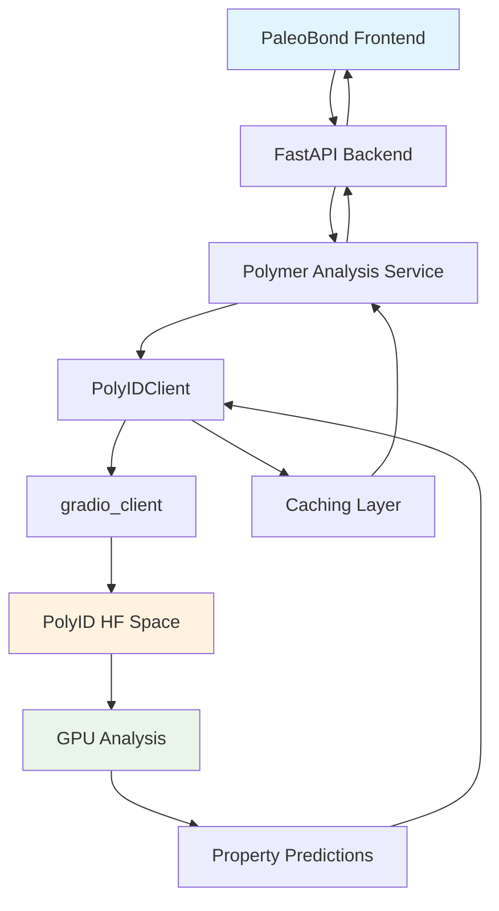

# PaleoBond PolyID Integration Documentation

## Overview

This document details how PaleoBond integrates with the PolyID Hugging Face Space for polymer property prediction. PaleoBond uses PolyID to analyze polymer molecules and predict their properties for preservation applications including hydrophane opal stabilization, pyrite disease prevention, fossil consolidation, and meteorite protection.

## Architecture

### Integration Flow



### Key Components

- **PolyIDClient** (`python-backend/app/polyid_client.py`): Main integration client
- **Polymer Analysis Service** (`python-backend/app/polymer_analysis.py`): Orchestrates polymer analysis
- **Caching Layer**: Redis-based prediction caching
- **Monitoring**: Performance tracking and error handling

## PolyIDClient API

### Core Classes

#### PolyIDProperties
```python
@dataclass
class PolyIDProperties:
    glass_transition_temp: float
    melting_temp: float
    decomposition_temp: float
    thermal_stability_score: float
    tensile_strength: float
    elongation_at_break: float
    youngs_modulus: float
    flexibility_score: float
    water_resistance: float
    acid_resistance: float
    base_resistance: float
    solvent_resistance: float
    uv_stability: float
    oxygen_permeability: float
    moisture_vapor_transmission: float
    biodegradability: float
    hydrophane_opal_compatibility: float
    pyrite_compatibility: float
    fossil_compatibility: float
    meteorite_compatibility: float
    analysis_time: float
    confidence_score: float
```

#### PolyIDResult
```python
@dataclass
class PolyIDResult:
    polymer_id: str
    smiles: str
    properties: PolyIDProperties
    validation_status: str = "pending"
    molecular_data: Dict[str, Any] = None
    predictions: Dict[str, Any] = None
    visualization_data: Dict[str, Any] = None
    error_message: Optional[str] = None
```

### Client Configuration

#### Environment Variables
```bash
# PolyID Space Configuration
POLYID_SPACE_URL=jkbennitt/polyid-private
POLYID_TIMEOUT=120
POLYID_MAX_RETRIES=3
POLYID_CACHE_ENABLED=true

# Authentication
HUGGINGFACE_TOKEN=hf_your_token_here
POLYID_API_KEY=hf_your_token_here
```

#### Client Initialization
```python
from app.polyid_client import PolyIDClient

client = PolyIDClient(
    space_url="jkbennitt/polyid-private",
    timeout=120.0,
    max_retries=3,
    cache_predictions=True
)
```

### Core Methods

#### Single Polymer Analysis
```python
async def analyze_polymer(self, smiles: str, properties: Optional[List[str]] = None) -> PolyIDResult:
    """
    Analyze a single polymer using PolyID API

    Args:
        smiles: SMILES string representation of the polymer
        properties: Optional list of specific properties to predict

    Returns:
        Complete analysis result with 22 properties
    """
```

#### Batch Analysis
```python
async def batch_analyze(self, smiles_list: List[str], properties: Optional[List[str]] = None) -> List[PolyIDResult]:
    """
    Analyze multiple polymers in batch

    Args:
        smiles_list: List of SMILES strings
        properties: Optional list of properties for all molecules

    Returns:
        List of analysis results
    """
```

#### Health Check
```python
async def health_check(self) -> Dict[str, Any]:
    """
    Check Space health and connectivity

    Returns:
        Health status with performance metrics
    """
```

### Error Handling

#### PolyIDAPIError
```python
class PolyIDAPIError(Exception):
    """Custom exception for PolyID API errors"""
    pass
```

#### Error Response Format
```json
{
  "polymer_id": "ERROR-0001",
  "smiles": "input_smiles",
  "properties": {
    "glass_transition_temp": 0.0,
    "analysis_time": 0.0,
    "confidence_score": 0.0
  },
  "validation_status": "failed",
  "error_message": "Analysis failed: [error details]"
}
```

## Integration Patterns

### In Polymer Analysis Service

```python
from app.polyid_client import get_polyid_client

class PolymerAnalysisService:
    def __init__(self):
        self.polyid_client = get_polyid_client()

    async def analyze_preservation_candidate(self, smiles: str) -> Dict[str, Any]:
        """Analyze polymer for preservation applications"""
        try:
            result = await self.polyid_client.analyze_polymer(smiles)

            # Extract preservation-relevant properties
            preservation_score = self._calculate_preservation_score(result.properties)

            return {
                "polymer_id": result.polymer_id,
                "smiles": result.smiles,
                "preservation_score": preservation_score,
                "properties": result.properties,
                "compatibility": {
                    "opal": result.properties.hydrophane_opal_compatibility,
                    "pyrite": result.properties.pyrite_compatibility,
                    "fossil": result.properties.fossil_compatibility,
                    "meteorite": result.properties.meteorite_compatibility
                },
                "status": result.validation_status
            }

        except PolyIDAPIError as e:
            logger.error(f"PolyID analysis failed for {smiles}: {e}")
            return self._create_error_response(smiles, str(e))
```

### Caching Strategy

```python
# Redis-based caching with TTL
CACHE_KEY_PREFIX = "polyid:prediction:"
CACHE_TTL = 3600  # 1 hour

def get_cache_key(smiles: str) -> str:
    """Generate cache key for SMILES"""
    return f"{CACHE_KEY_PREFIX}{hashlib.md5(smiles.encode()).hexdigest()}"

async def get_cached_prediction(smiles: str) -> Optional[PolyIDResult]:
    """Retrieve cached prediction"""
    cache_key = get_cache_key(smiles)
    cached_data = await redis.get(cache_key)
    if cached_data:
        return PolyIDResult(**json.loads(cached_data))
    return None

async def cache_prediction(smiles: str, result: PolyIDResult):
    """Cache prediction result"""
    cache_key = get_cache_key(smiles)
    await redis.setex(cache_key, CACHE_TTL, json.dumps(asdict(result)))
```

## Performance Characteristics

### Current Metrics
- **Response Time**: Variable (cold start: 5-300s, warm: <120s)
- **Success Rate**: High for web interface, API endpoints need fixes
- **Caching**: Client-side with 1-hour TTL
- **Batch Processing**: Not yet implemented (planned)

### Monitoring Integration

```python
# Performance tracking
monitoring_service.track_polyid_request(response_time, is_cold_start, success)

# Metrics updates
monitoring_service.update_polyid_metrics(
    total_requests=perf['total_requests'],
    cold_starts=perf['cold_starts'],
    average_response_time=perf['average_response_time']
)
```

## Preservation Applications

### Property Requirements by Application

#### Hydrophane Opal Stabilization
- **Molecular Weight**: 200-500 Da
- **Refractive Index**: 1.37-1.47
- **UV Stability**: >5000 hours
- **Penetration Depth**: >10mm
- **Key Properties**: `hydrophane_opal_compatibility`, `uv_stability`, `water_resistance`

#### Pyrite Disease Prevention
- **Oxygen Barrier**: Low `oxygen_permeability`
- **Iron Chelation**: High `acid_resistance`
- **Key Properties**: `pyrite_compatibility`, `oxygen_permeability`, `acid_resistance`

#### Fossil Consolidation
- **Controlled Penetration**: Balanced `water_resistance` and `solvent_resistance`
- **Strength Enhancement**: High `tensile_strength`
- **Key Properties**: `fossil_compatibility`, `tensile_strength`, `elongation_at_break`

#### Meteorite Protection
- **Oxidation Prevention**: Low `oxygen_permeability`
- **Chloride Extraction**: High `acid_resistance`
- **Key Properties**: `meteorite_compatibility`, `oxygen_permeability`, `uv_stability`

### Scoring Algorithm

```python
def calculate_preservation_score(properties: PolyIDProperties, application: str) -> float:
    """Calculate preservation suitability score"""

    weights = {
        "opal": {
            "hydrophane_opal_compatibility": 0.4,
            "uv_stability": 0.3,
            "water_resistance": 0.2,
            "thermal_stability_score": 0.1
        },
        "pyrite": {
            "pyrite_compatibility": 0.4,
            "oxygen_permeability": -0.3,  # Lower is better
            "acid_resistance": 0.3
        },
        "fossil": {
            "fossil_compatibility": 0.4,
            "tensile_strength": 0.3,
            "elongation_at_break": 0.2,
            "youngs_modulus": 0.1
        },
        "meteorite": {
            "meteorite_compatibility": 0.4,
            "oxygen_permeability": -0.3,
            "uv_stability": 0.2,
            "acid_resistance": 0.1
        }
    }

    score = 0.0
    app_weights = weights.get(application, {})

    for prop_name, weight in app_weights.items():
        prop_value = getattr(properties, prop_name, 0.0)
        # Normalize to 0-1 scale if needed
        normalized_value = min(max(prop_value, 0.0), 1.0) if prop_name.endswith('_compatibility') else prop_value
        score += normalized_value * abs(weight)

    return min(score, 1.0)  # Cap at 1.0
```

## API Endpoints

### Current PaleoBond Endpoints

#### POST `/api/polymers/analyze`
```typescript
interface AnalyzeRequest {
  smiles: string;
  application?: "opal" | "pyrite" | "fossil" | "meteorite";
}

interface AnalyzeResponse {
  polymer_id: string;
  smiles: string;
  preservation_score: number;
  properties: PolyIDProperties;
  compatibility: {
    opal: number;
    pyrite: number;
    fossil: number;
    meteorite: number;
  };
  status: "completed" | "failed";
  analysis_time: number;
}
```

#### POST `/api/polymers/batch-analyze` (Planned)
```typescript
interface BatchAnalyzeRequest {
  molecules: Array<{
    smiles: string;
    application?: string;
  }>;
}

interface BatchAnalyzeResponse {
  results: AnalyzeResponse[];
  summary: {
    total: number;
    successful: number;
    failed: number;
    average_time: number;
  };
}
```

### Future PolyID Endpoints (To Be Implemented)

#### POST `/run/batch_predict`
```json
{
  "data": [
    ["CC(C)(C)OC(=O)C=C"],
    ["CC=C(C)C(=O)OC"],
    ["C=CC6H5"]
  ]
}
```

#### GET `/health`
```json
{
  "status": "healthy",
  "models_loaded": true,
  "gpu_available": true,
  "response_time": 0.123
}
```

## Testing Strategy

### Unit Tests
```python
# test_polyid_client.py
@pytest.mark.asyncio
async def test_single_analysis():
    client = PolyIDClient()
    result = await client.analyze_polymer("CCO")

    assert result.validation_status == "completed"
    assert result.properties.confidence_score > 0
    assert len(result.properties) == 22  # All properties present

@pytest.mark.asyncio
async def test_batch_analysis():
    client = PolyIDClient()
    results = await client.batch_analyze(["CCO", "c1ccccc1"])

    assert len(results) == 2
    assert all(r.validation_status == "completed" for r in results)
```

### Integration Tests
```python
# test_polyid_integration.py
@pytest.mark.asyncio
async def test_full_pipeline():
    service = PolymerAnalysisService()
    result = await service.analyze_preservation_candidate("CC(C)(C)OC(=O)C=C")

    assert "preservation_score" in result
    assert "compatibility" in result
    assert result["status"] == "completed"
```

## Error Handling & Resilience

### Fallback Strategy
1. **Primary**: PolyID Space with real predictions
2. **Fallback 1**: Cached predictions (if available)
3. **Fallback 2**: Mock predictions with realistic values
4. **Fallback 3**: Error response with graceful degradation

### Monitoring & Alerts
- **Cold Start Detection**: Track requests >5min apart
- **Response Time Monitoring**: P95 latency tracking
- **Error Rate Monitoring**: Automatic alerts on high failure rates
- **GPU Utilization**: Track ZeroGPU performance

## Configuration Management

### Environment-Specific Settings
```python
# Development
POLYID_TIMEOUT=300  # Longer timeouts for debugging
POLYID_CACHE_ENABLED=false  # Disable caching for testing

# Production
POLYID_TIMEOUT=120  # Strict timeouts
POLYID_CACHE_ENABLED=true  # Enable caching
POLYID_MAX_RETRIES=5  # More retries in production
```

### Feature Flags
```python
ENABLE_POLYID_INTEGRATION=true
ENABLE_BATCH_PROCESSING=false  # Until implemented
ENABLE_ADVANCED_MONITORING=true
```

## Future Enhancements

### Planned Features
1. **Batch Processing**: Multiple SMILES in single request
2. **Advanced Caching**: Smart cache invalidation based on model updates
3. **Real-time Monitoring**: Live dashboard for PolyID performance
4. **Model Versioning**: Track which model version generated predictions
5. **A/B Testing**: Compare different model versions
6. **Custom Properties**: Application-specific property calculations

### Performance Optimizations
1. **Connection Pooling**: Reuse gradio_client connections
2. **Request Batching**: Group multiple requests for efficiency
3. **Smart Caching**: Cache based on molecular similarity
4. **Async Processing**: Non-blocking analysis for large batches

This documentation provides the complete specification for PaleoBond's PolyID integration, serving as both implementation guide and API reference.